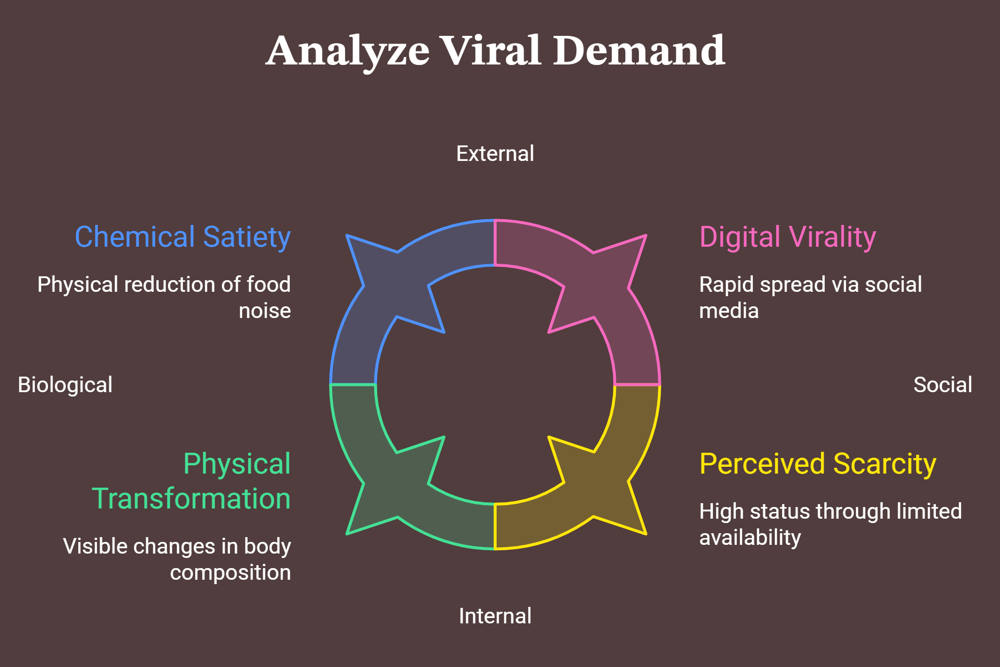

# Novo Nordisk: Ozempic, GLP-1s, and the Transformation of Consumer Wellness

**Author:** Anika Khatri 
**Date:** June 2026  
**Sector:** Medical Biotechnology / Metabolic Health / Consumer Psychology / Pharmaceuticals

---

## 1. Executive Summary
Novo Nordisk’s semaglutide molecules (marketed as Ozempic for Type 2 Diabetes and Wegovy for chronic weight management) have fundamentally altered the global pharmaceutical landscape. This case study evaluates the unprecedented consumer demand driving this phenomenon. Specifically, it analyzes how a clinical biotech therapeutic escaped traditional medical boundaries to tap into deep-seated consumer psychology, fueled by organic digital virality, behavioral biological loops, and a massive shift in how society defines wellness.

## 2. Scientific & Market Context: The GLP-1 Mechanism
Semaglutide is a synthetic analog of human Glucagon-Like Peptide-1 (GLP-1), an incretin hormone naturally secreted by the intestines. Biotechnologically, it acts as a GLP-1 receptor agonist, performing three core functions:
1. Stimulating insulin secretion in response to high glucose levels.
2. Slowing down gastric emptying (keeping food in the stomach longer).
3. Signaling the central nervous system to induce satiety and suppress appetite (chemically dampening "food noise").

Originally engineered as a chronic metabolic therapy for diabetes, the drug's potent secondary outcome—significant weight reduction—unlocked a completely separate, multi-billion-dollar consumer demographic driven by lifestyle and vanity aesthetics.

---

## 3. Applying the Trust Ladder Framework

### Tier 1: The Translation Problem (The Biology of Satiety vs. Lifestyle Vanity)
*How did complex metabolic chemistry translate into a viral consumer obsession?*

* **The Challenge:** Historically, pharmaceutical companies marketed weight management drugs through highly technical clinical efficacy charts or cautionary warnings. These methods rarely generated mainstream consumer enthusiasm.
* **The Breakthrough:** The consumer market bypassed corporate messaging entirely. The science was translated organically via digital platforms like TikTok and Instagram. Users didn't talk about "receptor affinity" or "gastric slowing"; they coined terms like "Ozempic Face" and celebrated the erasure of "food noise." 
* **The Psychology:** Novo Nordisk successfully navigated a unique scenario where the consumer took control of the brand's translation. The messaging shifted from clinical metabolic science to a highly relatable, lifestyle-centric narrative of effortless biology.

### Tier 2: The Trust Factor (Overcoming the Stigma of "The Easy Way Out")
*How does Novo Nordisk manage the psychological friction of biological weight loss?*

* **The Challenge:** Weight management is deeply tied to consumer identity, morality, and societal stigma. For decades, the public narrative dictated that weight loss must be achieved through willpower, diet, and exercise. Therapeutics were heavily stigmatized as "cheating" or dangerous "fad pills."
* **The Psychology Shift:** Semaglutide reframed obesity from a moral or psychological failing to a chronic, biological hormone deficiency. By demonstrating concrete clinical trials where weight loss was tied directly to chemical satiety receptors, Novo Nordisk’s product decoupled weight management from shame. 
* **The Validation Multiplier:** Trust was cemented not through traditional magazine ads, but through high-profile, unprompted organic endorsements from tech billionaires, Hollywood celebrities, and mainstream influencers. This elite societal validation acted as a massive psychological greenlight for the everyday consumer.

### Tier 3: The Competitive Advantage (The Moat of Extreme Scarcity)
*How does Novo Nordisk sustain market dominance amidst supply shortages and compounding competition?*

* **The Challenge:** Unprecedented demand led to massive global supply shortages, frustrating diabetic patients who relied on the medication and triggering public relations backlash.
* **The Consumer Psychology of Scarcity:** Ironically, product shortages fueled the consumer desire to obtain it. In consumer psychology, extreme scarcity increases perceived value. Ozempic became a high-status luxury asset within the wellness community.
* **The Strategic Moat:** Novo Nordisk's ultimate advantage is its early clinical data footprint and proprietary manufacturing infrastructure for sterile injection pens. While competitors like Eli Lilly (Mounjaro/Zepbound) have entered the market with dual-acting agonists, Novo Nordisk's brand equity is so deeply embedded that "Ozempic" has become the genericized trademark for the entire GLP-1 drug class (similar to Band-Aid or Xerox).

---

## 4. Strategic Lessons for Biotech Management

1. **Consumer Agility Trumps Corporate Control:** Sometimes, the market will find a more compelling use case and narrative for your technology than your original marketing plan. Companies must remain agile enough to lean into consumer-led narratives while maintaining strict regulatory compliance.
2. **De-Stigmatization is a Powerful Value Driver:** If a biotechnology product can successfully shift a consumer problem from a place of emotional guilt to a place of objective, treatable biology, it can unlock an unprecedented level of consumer adoption and brand loyalty.
3. **Supply Chain is Part of Brand Image:** In the pharmaceutical-to-consumer crossover space, your ability to manufacture and distribute reliably is a core pillar of public trust. Scientific genius cannot save a brand if patients face sudden, high-anxiety structural shortages of their maintenance medication.
