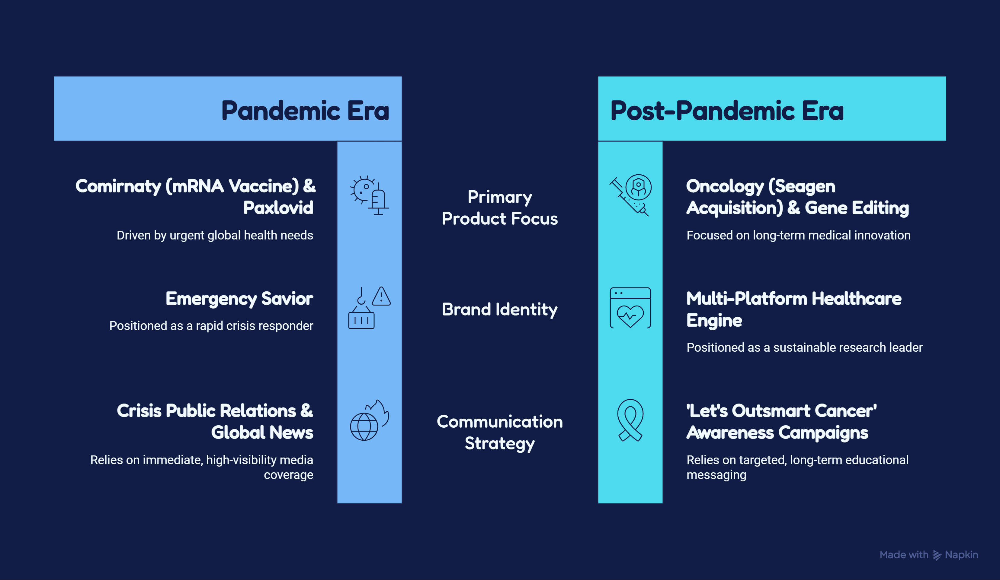

# Pfizer: The Post-Pandemic Brand Pivot & The Trust Dilemma

**Author:** Anika Khatri  
**Date:** June 2026  
**Sector:** Medical Biotechnology / Pharmaceuticals / Global Brand Strategy

---

## 1. Executive Summary
During the COVID-19 pandemic, Pfizer achieved unprecedented global visibility, morphing from a traditional B2B pharmaceutical manufacturing giant into a consumer-facing household name. This case study evaluates Pfizer’s post-pandemic brand trajectory, exploring how the company manages its reputation, addresses public skepticism, and pivots its marketing strategy to sustain trust as it transitions its focus toward oncology, rare diseases, and regular commercial pharmaceutical portfolios.

## 2. Market Context: The "Wartime" vs. "Peacetime" Brand Shift
In 2020–2021, Pfizer operated in a "wartime" economy. Alongside its partner BioNTech, it executed the fastest vaccine development and rollout in human history. This period yielded an immense boost in corporate reputation, often referred to as a "halo effect." 

However, as the global emergency faded, Pfizer faced sharp revenue drops from its COVID-14 products and a shifting public landscape. The brand shifted from being viewed as an emergency savior to a traditional corporation facing intense scrutiny over vaccine pricing, long-term safety questions, and intellectual property access.

---

## 3. Applying the Trust Ladder Framework

### Tier 1: The Translation Problem (Communicating the Next Wave of Science)
*How does Pfizer explain complex post-pandemic science without the urgency of a global lockdown?*

* **The Challenge:** During the pandemic, terms like "mRNA transcription," "lipid nanoparticles," and "efficacy rates" became mainstream because of immediate survival necessity. Now, Pfizer is trying to launch complex therapies in oncology (cancer treatments) and gene editing, where consumer attention spans are much lower.
* **Strategic Shift:** Pfizer has shifted its marketing away from single-product mechanics and toward broader human narratives. Their recent global rebranding campaigns focus heavily on the heritage of science (e.g., their "Let's Outsmart Cancer" initiatives). They use clean, optimistic digital visuals to translate highly intricate biochemical pipelines into simple messages of "hope" and "scientific progress."

### Tier 2: The Trust Factor (Navigating Polarization and Public Skepticism)
*How does the company combat post-pandemic vaccine fatigue and misinformation?*

* **The Challenge:** The hyper-accelerated timeline of the COVID-19 vaccine inadvertantly fueled global skepticism regarding safety trials, regulatory approvals, and corporate intent. Pfizer became a lightning rod for anti-pharma sentiment.
* **Strategic Shift:** 
  * **Proactive Clinical Transparency:** To restore trust, Pfizer has expanded its public-facing data sharing, creating open portals that simplify clinical trial results for regular people, not just doctors.
  * **Third-Party Medical Advocacy:** Rather than relying purely on corporate press releases, Pfizer heavily leverages independent medical professionals, academic researchers, and public health bodies to provide third-party validation for their pipelines.

### Tier 3: The Competitive Advantage (Reinventing the Corporate Identity)
*How does Pfizer position itself against agile biotech startups and traditional rivals like Moderna or Eli Lilly?*

* **The Challenge:** Companies like Moderna are viewed natively as cutting-edge "biotech disruptors," while companies like Eli Lilly have captured consumer minds through metabolic health innovations (GLP-1s). Pfizer risks being seen as an old-school legacy corporation.
* **Strategic Shift:** Pfizer's current competitive moat relies on its **scale and execution capacity**. Their strategic marketing positions them as the ultimate engine that can take raw biotech discoveries (like their acquisition of Seagen for targeted cancer therapies) and scale them globally. Their brand voice is moving away from just "vaccines" and redefining itself as a multi-platform powerhouse driven by bio-based nutrition, genomics, and oncology.

---

## 4. Strategic Lessons for Biotech Management

1. **Reputational Halos Do Not Last Forever:** High public trust earned during an emergency does not automatically transfer to everyday business operations. Brands must continuously reinforce their core values to keep that trust.
2. **Corporate Transparency is No Longer Optional:** In the modern digital age, complex medical science will be heavily scrutinized. Startups and legacy giants alike must make scientific trial data easily understandable and accessible to the public to stay ahead of misinformation.
3. **The Power of Strategic Co-Branding:** Pfizer's partnership with the highly agile German biotech startup BioNTech proved that legacy giants can achieve maximum brand agility when they combine their manufacturing power with a startup's specialized scientific innovation.
